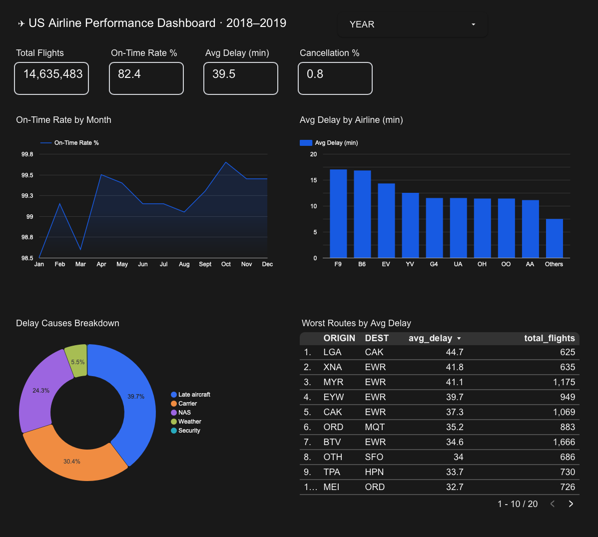

# ✈️ US Airline Performance Dashboard

Interactive dashboard analyzing 14.6M+ flight records from the Bureau of Transportation Statistics (2018–2019).

## 🔗 Live Dashboard
[View on Looker Studio](https://datastudio.google.com/reporting/18c6fac1-ce0c-4dda-8623-ba63ef2c6cec)]

## 📊 Dashboard Preview

## 🎯 Key Findings
- **On-time rate**: 82.4% — 1 in 5 flights is delayed
- **Top delay cause**: Late aircraft (39.7%), not weather
- **Worst airline**: Frontier (F9) with avg 17 min delay
- **Worst route**: LGA → CAK with avg 44.7 min delay
- **Best months**: April and October show highest punctuality

## 🛠️ Tools & Stack
- **Python** (pandas) — data processing & aggregation
- **Google Sheets** — data storage
- **Looker Studio** — interactive dashboard

## 📁 Dataset
[Airline Delay Analysis — Kaggle](https://www.kaggle.com/datasets/sherrytp/airline-delay-analysis)  
Source: Bureau of Transportation Statistics  
Records: 14,635,483 flights · Years: 2018–2019

## 🔄 Process
1. Loaded raw CSV files (800MB each) with selective columns
2. Extracted date features from FL_DATE
3. Aggregated into 5 lean tables (KPI, monthly, airlines, causes, routes)
4. Connected Google Sheets to Looker Studio
5. Built interactive dashboard with year filter
