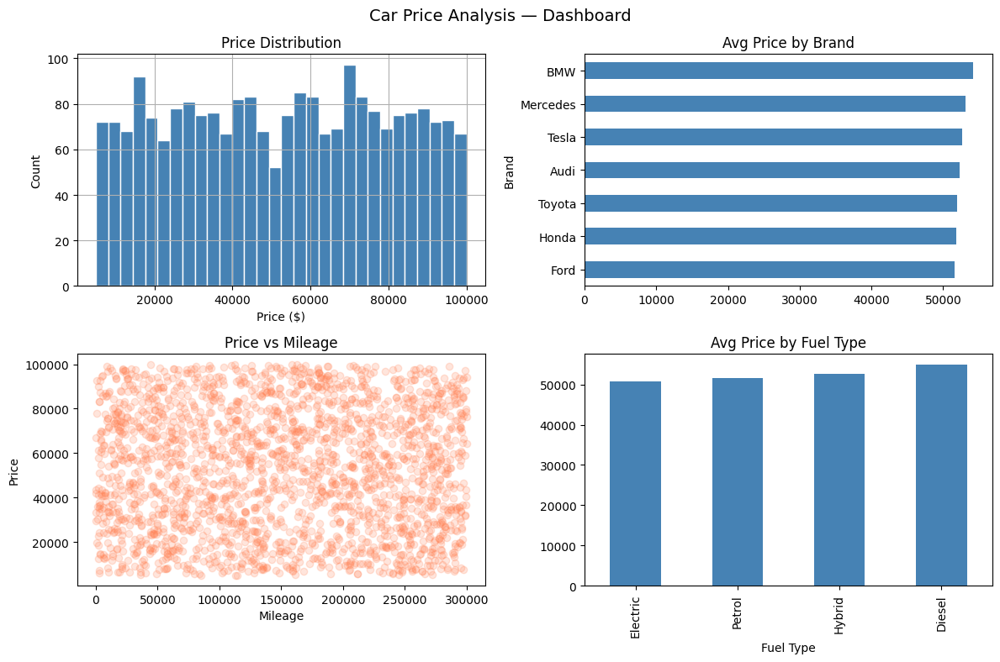

# Car Price Analysis

## Overview
Linear regression model to predict used car prices and identify key pricing factors.

**Tools:** Python · Pandas · Scikit-learn · Matplotlib  
**Dataset:** [Car Price Prediction](https://www.kaggle.com/datasets/nalisha/car-price-prediction-dataset) — Kaggle (synthetic, 2,250 rows)

---

## What Was Done
- Loaded dataset from Google Drive
- Cleaned missing values (10% of rows)
- EDA: distributions, correlations, group analysis
- Feature engineering: Age column, One-Hot Encoding
- Linear Regression model training and evaluation
- Dashboard visualization

---

## Key Findings

| Metric | Value |
|---|---|
| R² Score | 0.002 |
| Dataset type | Synthetic |
| Rows after cleaning | 2,250 |

**Why R² is low:** Prices in this synthetic dataset were generated randomly — no real correlation between features and price exists. On real market data, expected R² would be 0.75–0.90.

---

## Next Steps (on real data)
1. Use Random Forest or XGBoost
2. Add interaction features (Brand × Age)
3. Collect real Baltic market data (ss.lv, auto24.ee)

---

## Dashboard

---

## Files
| File | Description |
|---|---|
| `Car_Price_Analysis.ipynb` | Full analysis notebook |
| `dashboard.png` | Visualization dashboard |
