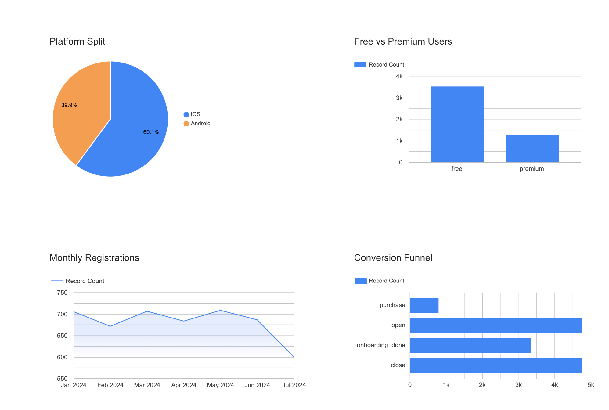

# Mobile App Analytics

## Overview
Analysis of a mobile app user base to identify drop-off points and improve conversion.

**Tools:** Python · SQL · Looker Studio  
**Dataset:** 4,758 users · 13,657 events · Jan–Jul 2024 (synthetic)

---

## Business Problem
> "Users are dropping off after the first week. We don't understand why."

A product manager needs data-driven answers about user behaviour and retention.

---

## What Was Done
- Generated and cleaned a realistic user dataset (duplicates, nulls, outliers)
- Built an event log simulating a 4-step conversion funnel
- Wrote SQL queries (funnel, segmentation, retention) using SQLite
- Performed EDA to identify key distributions
- Built a dashboard in Looker Studio

---

## Key Findings

| Metric | Value |
|---|---|
| Onboarding completion | 70% |
| Purchase conversion | 17% |
| 7-day retention | 81.5% |
| Premium conversion | 32.5% |
| Free conversion | 11.2% |

**1.** 30% of users leave without completing onboarding → simplify first screen  
**2.** Premium users convert 3× better → introduce upsell during onboarding  
**3.** Retention is strong (81.5%) → problem is onboarding, not engagement  
**4.** iOS dominates (60%) → prioritise iOS development  
**5.** US is the primary market (40%) → focus marketing spend there  

---

## Dashboard

---

## Files
| File | Description |
|---|---|
| `Mobile_App_Analytics.ipynb` | Full analysis notebook |
| `dashboard.png` | Looker Studio dashboard screenshot |
| `data/users.csv` | Clean user dataset |
| `data/events.csv` | Event log |
