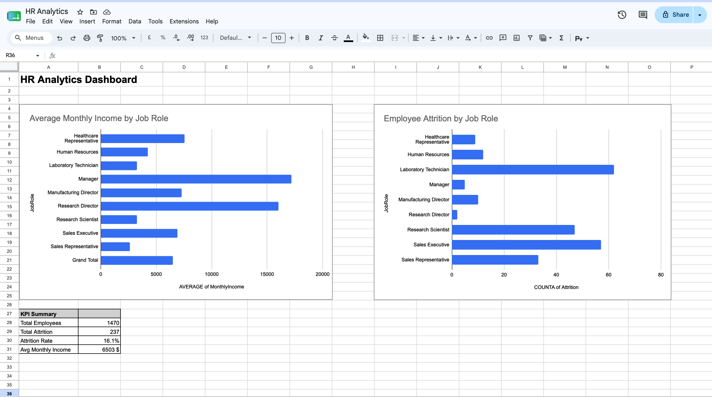

# Excel Advanced Formulas — HR Analytics 📊

## Overview
Hands-on practice of advanced Excel/Google Sheets lookup formulas using IBM HR Analytics dataset. Two separate tables joined by EmployeeNumber key.

## Tools
Google Sheets (Excel-compatible)

## Skills Demonstrated
- **VLOOKUP** — lookup salary by employee ID
- **INDEX+MATCH** — flexible lookup in any direction
- **XLOOKUP** — modern simplified lookup syntax
- **Pivot Tables** — salary and attrition analysis
- **ARRAYFORMULA + XLOOKUP** — joining two tables (equivalent of SQL JOIN)
- **Dashboard** with KPI block

## Dataset
- Source: [IBM HR Analytics](https://www.kaggle.com/datasets/pavansubhasht/ibm-hr-analytics-attrition-dataset)
- 1,470 employees, 36 features
- Split into two tables: Employee_Info and Compensation

## Key Findings
- Managers earn 4x more than Laboratory Technicians ($17,182 vs $3,237)
- Laboratory Technicians have highest attrition (62 employees)
- Overall attrition rate: 16.1%
- Average monthly income: $6,503

## Formula Comparison

| Task | Formula |
|---|---|
| Find salary by ID | `=VLOOKUP(A2, Compensation!A:B, 2, 0)` |
| Flexible lookup | `=INDEX(Compensation!B:B, MATCH(A2, Compensation!A:A, 0))` |
| Modern syntax | `=XLOOKUP(A2, Compensation!A:A, Compensation!B:B)` |

## Dashboard

