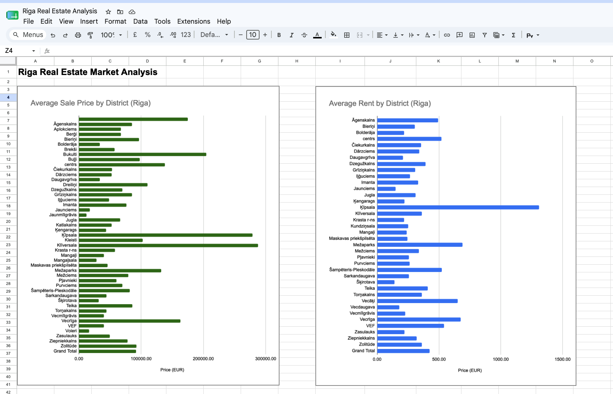
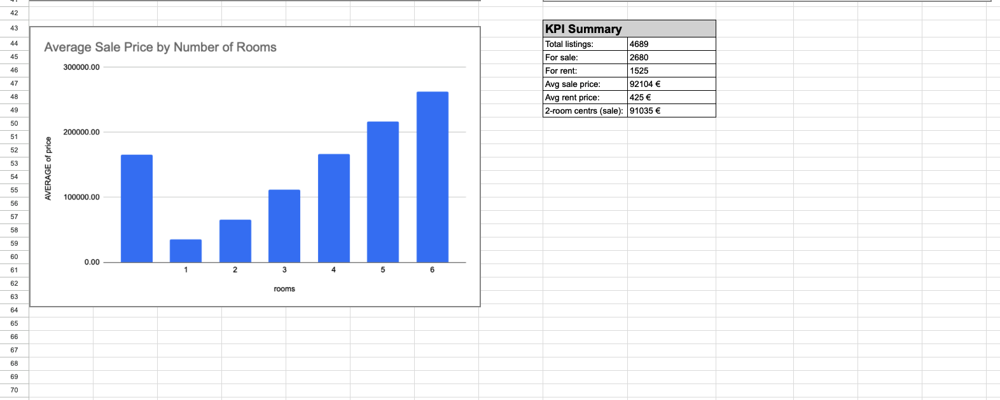

# Riga Real Estate Market Analysis 🏠

## Overview
Analysis of 4,689 real estate listings in Riga, Latvia using Google Sheets.
Dataset source: [Kaggle — Riga Real Estate Dataset](https://www.kaggle.com/datasets/trolukovich/riga-real-estate-dataset)

## Tools
Google Sheets (Excel-compatible)

## Skills Demonstrated
- Data cleaning with FILTER function
- COUNTIF, AVERAGEIF, AVERAGEIFS, ROUND
- Pivot Tables (3 tables)
- Conditional Formatting (Color Scale)
- VLOOKUP
- Dashboard design

## Dataset
- 4,689 total listings
- Cleaned to 4,205 rows (excluded Buying/Renting/Other categories)
- Columns: op_type, district, street, rooms, area, floor, house_type, condition, price

## Key Findings
- Most expensive districts: Klīversala (avg €288k), Ķīpsala (avg €279k)
- Most affordable districts: Jaunmīlgrāvis (avg €12k), Daugavgrīva (avg €34k)
- Price grows linearly with rooms: 1 room €35k → 6 rooms €263k
- Average sale price: €92,104
- Average rent: €425/month (Ķīpsala most expensive at €1,309)
- 2-room apartment in city centre: ~€91,035

## Dashboard

